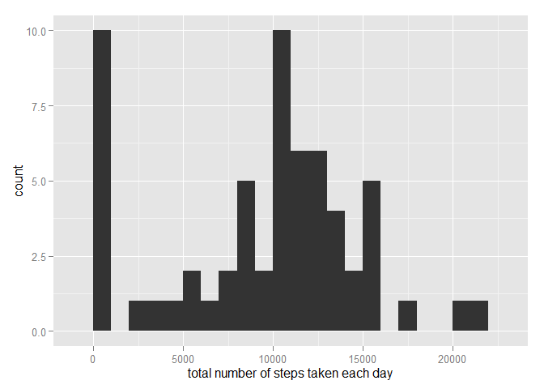
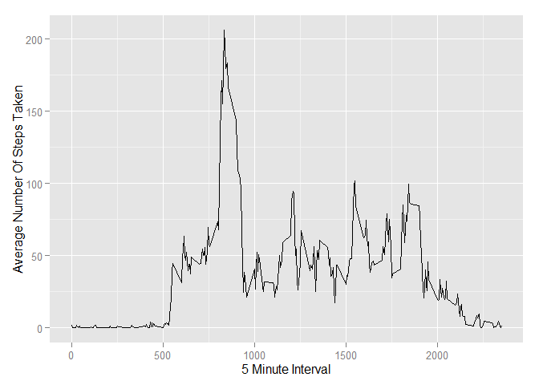
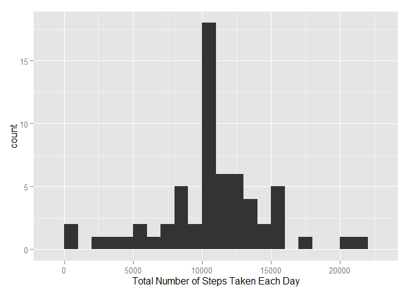
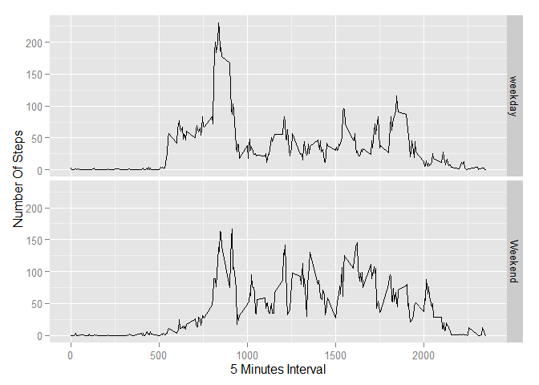

# Reproducible Research: Peer Assessment 1


## Loading and preprocessing the data

```r
unzip(zipfile="activity.zip")
data <- read.csv("activity.csv",sep=",", na.strings ="NA", colClasses=c("numeric","Date","numeric"))
```

## What is mean total number of steps taken per day?

```r
library(ggplot2)
total_no.steps <- tapply(data$steps, data$date, FUN=sum, na.rm=TRUE)
qplot(total_no.steps, binwidth=1000, xlab="total number of steps taken each day")
```

 
```
calculate the mean and median (total number of steps (taken per day)
mean(total_no.steps, na.rm=TRUE)
median(total_no.steps, na.rm=TRUE)
```

## What is the average daily activity pattern?

```r
avg <- aggregate(x=list(steps=data$steps), by=list(interval=data$interval),
                      FUN=mean, na.rm=TRUE)
ggplot(data=avg, aes(x=interval, y=steps)) +
  geom_line() +
  xlab("5 Minute Interval") +
  ylab("Average Number Of Steps Taken")
```

 

```r
avg[which.max(avg$steps),]
```

```
##     interval    steps
## 104      835 206.1698
```

## Imputing missing values
The dataset (days and intervals) have many missing values ("NA"). The missing data may calculate and fill into summaries of the data.

```r
missing_data <- is.na(data$steps)
#calculate missing data
table(missing_data)
```

```
## missing_data
## FALSE  TRUE 
## 15264  2304
```
All mising value ("NA") are replaced with mean value for that 5 minutes interval

```r
data_fill.value <- function(steps, interval) {
  fill <- NA
  if (!is.na(steps))
    fill <- c(steps)
  else
    fill <- (avg[avg$interval==interval, "steps"])
  return(fill)
}
fill.data <- data
fill.data$steps <- mapply(data_fill.value, fill.data$steps, fill.data$interval)
```
Plot histogram of the total number of steps taken each day and find the mean and median total number of steps with fill dataset

```r
total_no.steps <- tapply(fill.data$steps, fill.data$date, FUN=sum)
qplot(total_no.steps, binwidth=1000, xlab="Total Number of Steps Taken Each Day")
```

 

```r
mean(total_no.steps)
```

```
## [1] 10766.19
```

```r
median(total_no.steps)
```

```
## [1] 10766.19
```

## Are there differences in activity patterns between weekdays and weekends?

```r
weekday.or.weekend <- function(date) {
  day <- weekdays(date)
  if (day %in% c("Monday", "Tuesday", "Wednesday", "Thursday", "Friday"))
    return("weekday")
  else if (day %in% c("Saturday", "Sunday"))
    return("Weekend")
  else
    stop("Invalid Date")
}
fill.data$date <- as.Date(fill.data$date)
fill.data$day <- sapply(fill.data$date, FUN=weekday.or.weekend)
```
make plot that contain aveerage number of steps taken on weekdays and weekends.

```r
avg <- aggregate(steps ~ interval + day, data=fill.data, mean)
ggplot(avg, aes(interval, steps)) + geom_line() + facet_grid(day ~ .) +
  xlab("5 Minutes Interval") + ylab("Number Of Steps")
```

 
